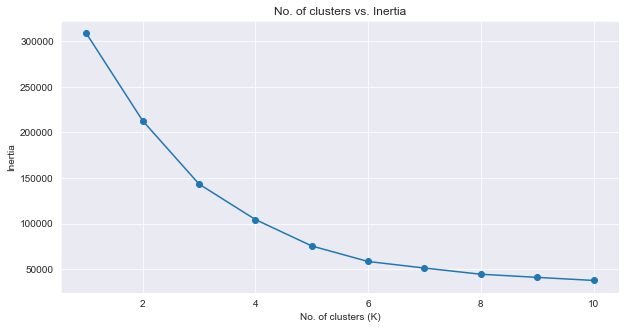
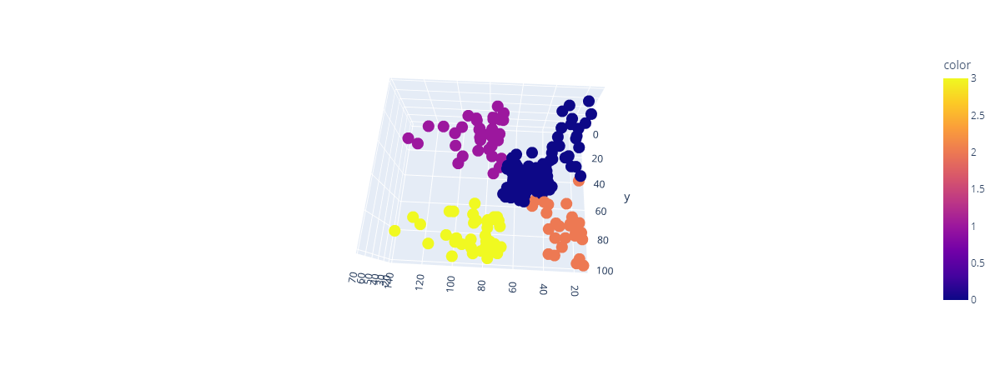
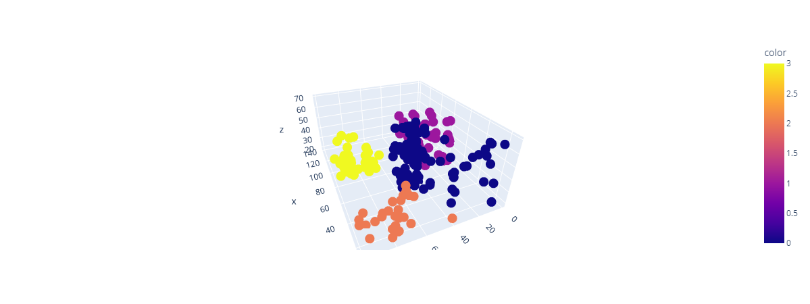
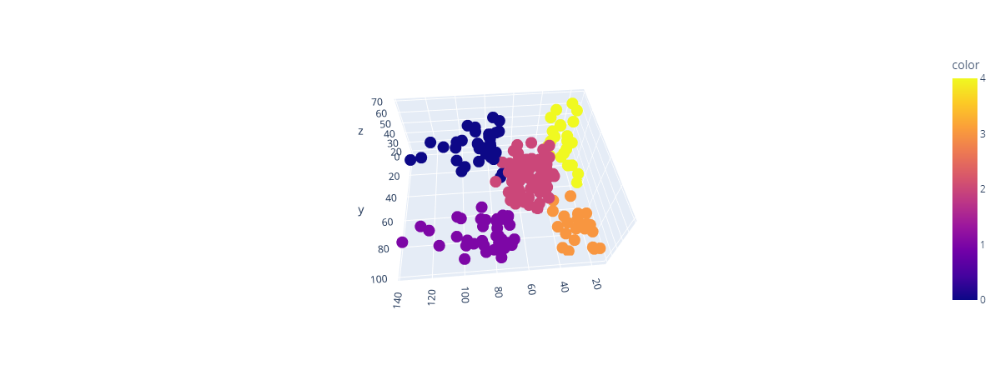

## Mall Customer Segmentation
___
This is a clutering project that tries to group customers in a dataset based on their age, gender, annual income (in $ thousands) and Spending Score (0-100).
___
4 clusters seemed optimal for grouping as it had the best elbow when measuring inertia

___
4 clusters also seemed to group the data very well but the blue group seemed to have huge spreads

___
So a 5 cluster group solved that problem

___

Thank you